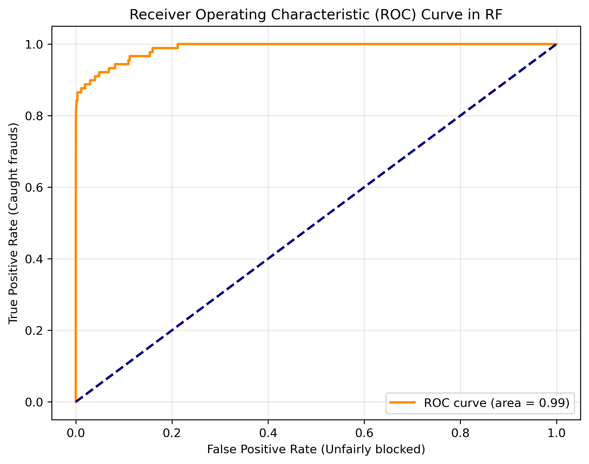
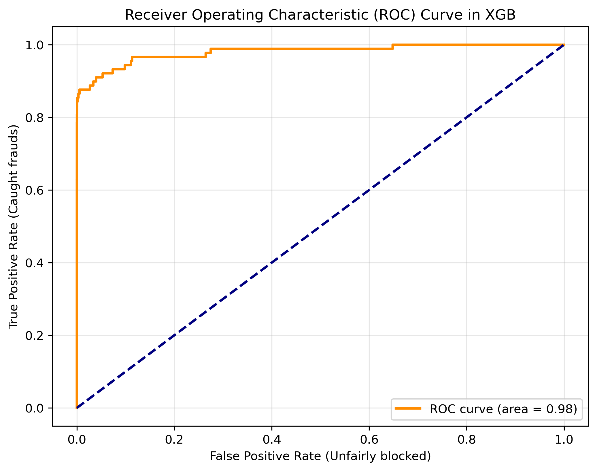
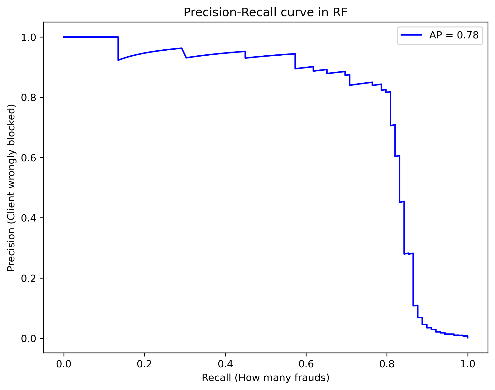
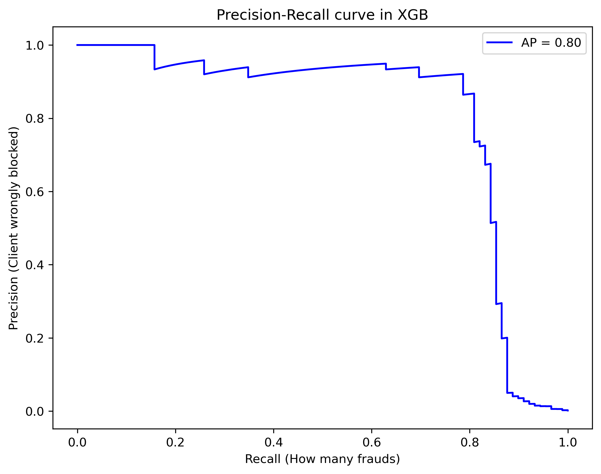
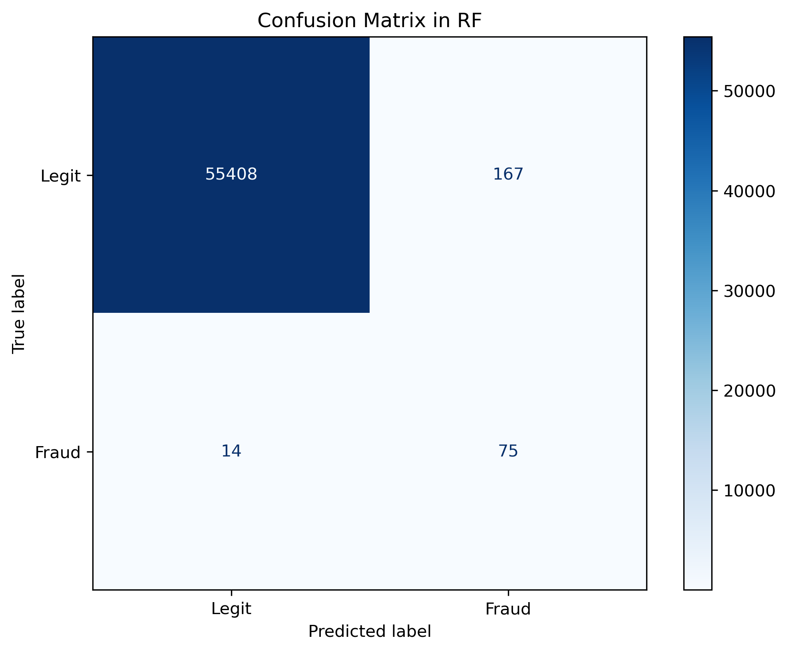
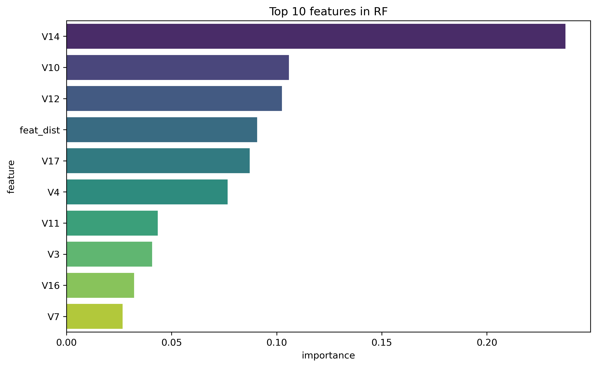
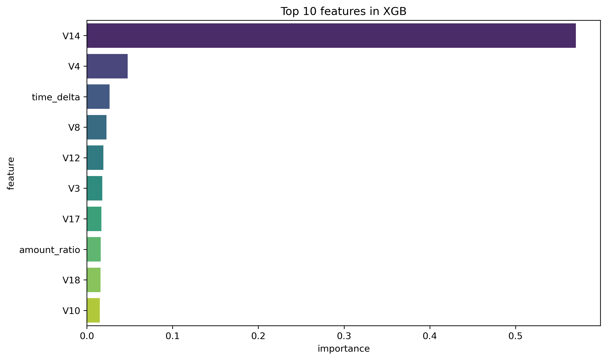

# 🛡️ Real-Time Credit Card Fraud Detection System

A Machine Learning pipeline and REST API designed to detect fraudulent transactions using behavioral analysis and Explainable AI (XAI).

## 🌟 Key Features
* **End-to-End Pipeline:** From raw data to a live production API.
* **Feature Engineering:**
    * `feat_dist`: High-dimensional Euclidean distance measuring behavioral shifts (Top 5 Feature).
    * `amount_ratio` & `amount_zscore`: Real-time anomaly detection in transaction values.
    * `time_delta`: Captures high-frequency attack patterns.
* **Explainable AI (XAI):** Integrated **SHAP** (Global & Local) to provide full transparency for every "BLOCK" decision.
* **Production-Ready API:** Built with **FastAPI**, featuring automated Swagger documentation and input validation.

## 🏗️ System Architecture
The project follows a modular structure for scalability:
* `Features/`: Custom logic for behavioral feature extraction.
* `src/`: Core engine (Preprocessing, Training, Evaluation, XAI).
* `api/`: REST API implementation for real-time inference.
* `models/`: Persistent storage for trained models, scalers, and metadata.

## 📊 Model Performance & Comparison

The system evaluates two powerful architectures to find the optimal balance between catching fraud and maintaining a smooth customer experience.

### Battle of the Models: RF vs XGBoost

| Metric | Random Forest (SMOTE) | XGBoost (Weighted) | Winner |
| :--- | :--- | :--- | :--- |
| **ROC AUC** | **0.99** | 0.98 | **Random Forest** |
| **Average Precision (AP)** | 0.78 | **0.80** | **XGBoost** |
| **True Positives (Caught Frauds)** | 75 | **76** | **XGBoost** |
| **False Positives (Unfairly Blocked)** | 167 | **94** | **XGBoost** |

**Business Impact:** While both models perform exceptionally well, **XGBoost** is the superior choice for production. It catches more fraud cases while **reducing False Positives by 44%** (94 vs 167). This significantly lowers operational costs and prevents unnecessary customer friction.

### Performance Visualization

<p align="center">
  
  
</p>
<p align="center">
  <em>ROC Curves show near-perfect class separation for both models (AUC 0.98-0.99).</em>
</p>

<p align="center">
  
  
</p>
<p align="center">
  <em>Precision-Recall curves highlight XGBoost's advantage (AP = 0.80) in maintaining precision at higher recall levels.</em>
</p>

### Confusion Matrix Comparison

<p align="center">
  
  
</p>

---

## 🔍 Feature Importance & Interpretability

The models utilize different logic to identify fraud, providing a multi-dimensional view of suspicious activity:

* **Random Forest:** Relies heavily on latent features (`V14`, `V10`, `V12`) and the custom `feat_dist` metric to ensure decision stability.
* **XGBoost:** Takes a more aggressive approach by leveraging time dynamics (`time_delta`) and transaction proportions (`amount_ratio`), allowing for faster detection of evolving attack patterns.

<p align="center">
  
  
</p>
<p align="center">
  <em>Feature Importance: Both models agree that V14 is the strongest fraud indicator, but XGBoost places higher value on the temporal aspects of the transaction.</em>
</p>

### ⚡ API Deployment
The API currently uses the **XGBoost** model as the primary inference engine. 
Decision: **XGBoost was chosen over Random Forest** due to its superior Precision-Recall balance 
(AP = 0.80) and significantly lower False Positive Rate, ensuring a better customer experience 
by reducing "unfairly blocked" transactions by 44%.

**Business Impact:** While both models perform exceptionally well, **XGBoost** is the superior choice for production. It catches more fraud cases while **reducing False Positives by 44%** (94 vs 167). This significantly lowers operational costs and prevents unnecessary customer friction.

## 🏗️ Project Structure
```text
fraud_detection/
├── api/                # FastAPI application & Pydantic schemas
├── plots/              # Figures used in evaluation
├── models/             # Serialized (.pkl) models, scalers, and metadata
├── src/                # Core ML logic (Preprocessing, Training, Evaluator)
├── __main__.py         # Package entry point for the training pipeline
├── Dockerfile          # Container configuration for production
├── .dockerignore       # Files to exclude from the Docker image
└── requirements.txt    # Python dependencies with pinned versions

---
## 🔗 Let's Connect!

If you have any questions about this Fraud Detection system or want to discuss ML Engineering, feel free to reach out:

* 💼 **LinkedIn:** [www.linkedin.com/in/bartosz-pliszka-b502bb359]
* 📧 **Email:** [bartekpliszka@op.pl]

---